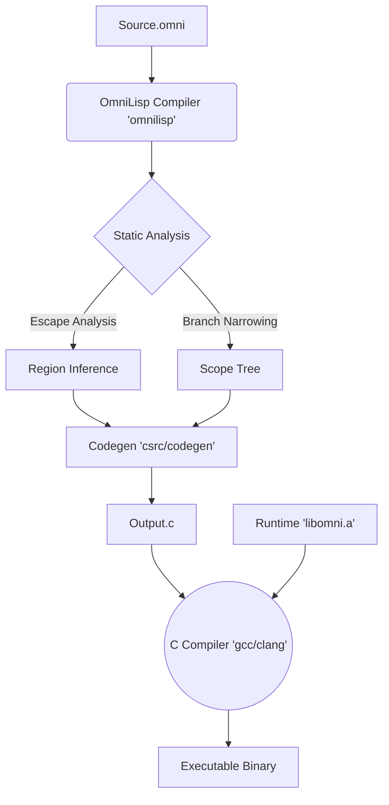

# Architecture Diagrams (CTRR / Region Control Blocks)

## 1. Compilation Pipeline

OmniLisp utilizes a distinct Compiler (`csrc`) and Runtime (`libomni.a`) architecture.



## 2. Implemented Memory Architecture (Region-RC)

This model is fully implemented. It unifies memory management under **Regions**, controlled by static analysis and runtime topology.

```
┌─────────────────────────────────────────────────────────────────┐
│                    COMPILE-TIME ANALYSIS                         │
│                                                                  │
│  Region Inference ──► Group Objects by Lifetime                 │
│  Escape Analysis  ──► DOES GROUP ESCAPE SCOPE?                  │
└─────────────────────────────────────────────────────────────────┘
                              │
          ┌───────────────────┴───────────────────┐
          ▼                                       ▼
    **NO ESCAPE**                           **ESCAPES**
 (Local Scratchpad/Stack)                (Shared / Returned)
          │                                       │
          │                               ┌───────┴───────┐
          │                               ▼               ▼
          │                        **WHOLE**           **PARTIAL**
          │                     (Region Promoted)    (Subset Escapes)
          ▼                               │               │
      **CTRR-local (scratch)**            │               ▼
   (Static Region Free)                   ▼        **TRANSMIGRATION**
    - Arena Backend                **REGION RC**    (Eager Deep Copy)
    - Zero Runtime Cost           (Refcounted RCB)    - Copy to Dest
    - Bulk Reclamation            - Tethers for       - Orig Region
                                    Mutation            Reclaimed
```

## 3. Branch-Level Region Narrowing (Phase 15)

Implemented in `csrc/analysis` and `csrc/codegen`.

```
Function Scope
┌─────────────────────────────────────────────────────────┐
│  Region R_Func                                          │
│                                                         │
│  (let [x (heavy-computation)]                           │
│     (if (condition)                                     │
│         ┌─────────────────────────┐                     │
│         │ Branch A (Escaping)     │                     │
│         │ [Allocates in R_Func]   │                     │
│         │ Returns x               │                     │
│         └─────────────────────────┘                     │
│         ┌─────────────────────────┐                     │
│         │ Branch B (Local)        │                     │
│         │ [Stack / Temp Region]   │◄── OPTIMIZED        │
│         │ (print "debug")         │    Allocations here │
│         │ Returns 0               │    do NOT pollute   │
│         └─────────────────────────┘    R_Func           │
│     ))                                                  │
└─────────────────────────────────────────────────────────┘
```

## 4. Concurrency Model

```text
┌─────────────────────────────────────────────────────────────────┐
│ Thread Local Storage (TLS)                                      │
│ ┌─────────────────────────────────────────────────────────────┐ │
│ │ Tether Cache (MAX=16)                                       │ │
│ │ ├─ [Region A]: Count 3  ───┐                                │ │
│ │ └─ [Region B]: Count 1  ───│──┐                             │ │
│ └────────────────────────────│──│─────────────────────────────┘ │
└──────────────────────────────│──│───────────────────────────────┘
                               │  │
        Refers to/Pins         │  │
                               ▼  ▼
┌─────────────────────────────────────────────────────────────────┐
│ Region Control Block (RCB)                                      │
│ ├─ external_rc:  [Atomic] (Strong refs from other regions/stack)│
│ ├─ tether_count: [Atomic] (Sum of all active thread borrows)    │
│ ├─ scope_alive:  [Bool]   (Static liveness signal from CTRR compiler) │
│ └─ arena:        [Arena]  (Physical bump allocator)             │
└───────────────────────────────────────┬─────────────────────────┘
                                        │
                                        │ owns
                                        ▼
┌─────────────────────────────────────────────────────────────────┐
│ Arena (Linked Physical Blocks)                                  │
│ ┌──────────────┐      ┌──────────────┐      ┌──────────────┐    │
│ │ Block 1      │───▶  │ Block 2      │───▶  │ Block 3 (End)│    │
│ │ [Obj][Obj]   │      │ [Obj][String]│      │ [Free Space] │    │
│ └──────────────┘      └──────────────┘      └──────────────┘    │
└─────────────────────────────────────────────────────────────────┘
```
