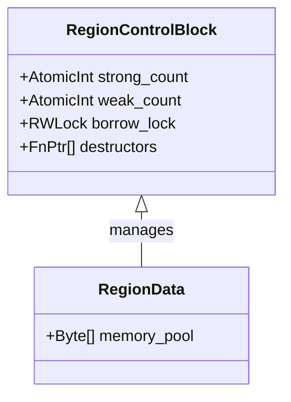

# Region-Based Reference Counting (RC-G) Architecture

## 1. Overview

This document outlines an architectural design for a **Region-Based Reference Counting (RC-G)** system. It derives its core philosophy from the "Group Borrowing" concepts (specifically Nick Smith's borrowing system), adapting them from a static analysis model into a runtime memory management strategy.

### Core Philosophy
- **Granularity:** Reference counting is expensive when applied to every single object. RC-G applies reference counting to **Regions** (Groups), not individual objects.
- **Cohesion:** Objects that evolve together live in the same Region.
- **Isolation:** Distinct components (logical groups) live in separate Regions, allowing independent lifecycles and "partial borrowing" semantics.

## 2. Memory Semantics

### 2.1 The Region (The "Group")
The fundamental unit of memory management is the **Region**.

*   **Definition:** A contiguous (or paged) arena of memory that holds one or more objects.
*   **Header:** Every Region has a control block containing:
    *   `strong_count`: Number of strong references (owners) to this Region.
    *   `borrow_state`: (Optional) Dynamic borrow tracking (e.g., Reader/Writer bits) to enforce runtime safety if desired.
    *   `destructor_table`: List of cleanups to run when the region dies.



### 2.2 Objects
*   **Definition:** Typed data residing *inside* a Region.
*   **Lifecycle:** An object's memory is valid as long as its containing Region is valid.
*   **Destruction:** Objects do not have individual `free()`. Instead, they register destructors (if needed) with the Region. When the Region RC drops to zero, all registered destructors run, and the memory is reclaimed in bulk.

## 3. Pointer & Reference Semantics

The system distinguishes between three types of pointers:

### 3.1 Region Reference (The "Smart Pointer")
A fat pointer that owns or observes a Region. This is the primary handle used to pass data around.

*   **Structure:** `{ T* data_ptr, RegionControl* region_ctx }`
*   **Semantics:**
    *   **Clone:** Increments `region_ctx->strong_count`.
    *   **Drop:** Decrements `region_ctx->strong_count`.
    *   **Access:** `data_ptr` is safe to dereference because `region_ctx` guarantees liveness.

### 3.2 Intra-Region Pointer (The "Raw Pointer")
A naked pointer used *within* a region or for short-lived stack operations where the Region's liveness is guaranteed by the scope.

*   **Structure:** `{ T* data_ptr }` (Standard C pointer)
*   **Semantics:**
    *   **Fast:** No RC overhead.
    *   **Unsafe (Contextual):** Must only be used when the parent `RegionReference` is known to be alive (e.g., inside a function taking `RegionReference` as an argument).

### 3.3 Inter-Region Link (The "Edge")
When an object in **Region A** points to an object in **Region B**.

*   **Structure:** Stored inside an object in Region A. It must be a **Region Reference** (Strong).
*   **Graph:** This creates a directed graph of Regions.
    *   Region A "owns" Region B via this link.
    *   If Region A is freed, its destructors run, releasing the Strong Ref to Region B (potentially freeing B).

## 4. Borrowing & Group Semantics

Adapting "Group Borrowing" to Runtime RC:

### 4.1 "Shell" vs. "Content" (The Group Split)
To maximize flexibility (and minimize RC contention), we encourage splitting complex objects into multiple Regions (Groups).

*   **Example:** A `GameLevel` object.
    *   **Region 1 (Shell):** Holds the `GameLevel` struct, scalar stats, and *links* to sub-regions.
    *   **Region 2 (Geometry):** Holds thousands of mesh vertices.
    *   **Region 3 (Entities):** Holds active NPC objects.

**Benefit:**
*   You can pass a mutable reference of **Region 3** to the `PhysicsSystem` while keeping **Region 1** and **Region 2** immutable (or accessible by the `RenderSystem`).
*   In a monolithic system, locking/borrowing `GameLevel` would lock everything. Here, `GameLevel` is just the root node.

### 4.2 Mutable Aliasing via Region Isolation
Since Regions are the unit of locking/borrowing:

1.  **Function Signature:** `update_entities(RegionRef<EntityList> entities)`
2.  **Call Site:**
    ```c
    // Valid because 'level.entities' is a distinct Region from 'level.geometry'
    spawn_job(update_geometry, level.geometry); // Borrows Region 2
    spawn_job(update_entities, level.entities); // Borrows Region 3
    // 'level' (Region 1) remains available for high-level logic if not mutably borrowed itself.
    ```

### 4.3 Reference Cycles
*   **Problem:** Region A holds Strong Ref to Region B; Region B holds Strong Ref to Region A.
*   **Solution:** Since we have explicit Regions, we can use **Weak Region References** for back-pointers (e.g., Child -> Parent).
*   **Cycle Collection (Advanced):** Since the graph nodes are coarse (Regions), a cycle detector is cheaper to run than on a per-object graph.

## 5. Visual Architecture

### 5.1 Memory Layout Diagram

```text
+---------------------+           +---------------------+
|      REGION A       |           |      REGION B       |
| (Root / Shell)      |           | (Payload / Group)   |
|                     |           |                     |
| [ Control Block ]   |           | [ Control Block ]   |
|   RC: 1             |           |   RC: 1             |
|   Lock: Unlocked    |           |   Lock: Write       |
+---------------------+           +---------------------+
| Data:               |           | Data:               |
|  Struct User        |           |  Array<Message>     |
|   - id: 101         |           |   [0]: "Hello"      |
|   - name: "Alice"   |           |   [1]: "World"      |
|   - msgs: Ref(B) -->+---------->|                     |
+---------------------+           +---------------------+
           ^
           |
      Stack Frame
     (User Handle)
```

### 5.2 Flow of Operations

1.  **Allocation:**
    *   User calls `Region::create()`. -> Allocates Region A.
    *   User calls `pool_alloc(A, sizeof(User))`. -> Returns ptr inside A.

2.  **Linking:**
    *   User calls `Region::create()`. -> Allocates Region B.
    *   `user->msgs = RegionReference(B)`. -> Region A's object now holds B alive.

3.  **Borrowing (Access):**
    *   User wants to read messages.
    *   `access(user->msgs)` checks `Region B` lock.
    *   Returns raw pointer `Message*` into Region B.

4.  **Destruction:**
    *   Stack frame ends. `User Handle` (Ref to A) drops.
    *   Region A RC -> 0. Destructors run.
    *   `user->msgs` destructor runs. Ref to B drops.
    *   Region B RC -> 0. Region B freed.

## 6. Summary of Rules

1.  **Always Reference Count the Region, never the Object.**
2.  **Intra-region pointers are raw and ephemeral.**
3.  **Inter-region pointers are Strong References (or Weak).**
4.  **Mutation requires unique access to the specific Region (Group).**
5.  **Splitting data into multiple Regions increases concurrency and reduces contention.**
