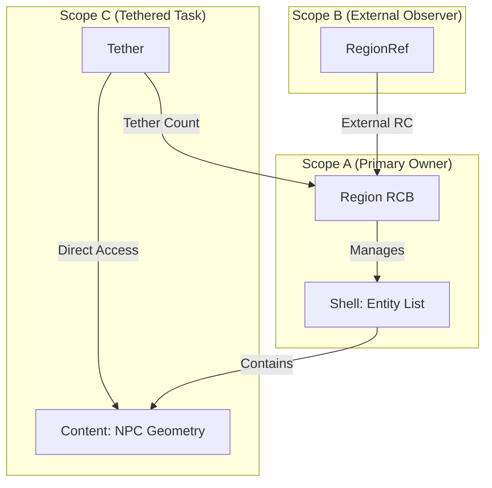

# Refined Region-Based Reference Counting (ASAP-Region)

## 1. Overview: The "No-Restriction" Philosophy

Unlike Rust's borrow checker or standard Atomic RC, this architecture (inspired by Nick Smith's "Group Borrowing") is designed to be **invisible to the developer** and **zero-cost for the execution**. It allows OmniLisp to feel like a high-level language while maintaining C99 + POSIX performance.

### Core Goals
- **Safe Mutable Aliasing:** Unlike Rust, you can have multiple references to a region while one is mutating it, provided the mutations don't invalidate the specific sub-groups being accessed.
- **ASAP-Driven:** Deallocation is statically determined by the compiler (ASAP). Reference counting acts as a **dynamic extension** for data that escapes static analysis.
- **Bulk Reclamation:** Instead of freeing objects one-by-one, we reclaim entire Regions (Islands) at once, solving the cycle problem without a Tracing GC.

## 2. Memory & Reference Semantics

The system operates on **Regions (Groups)**. A Region is a unit of isolation.

### 2.1 Region Control Block (RCB)
Every region has a header (RCB) that tracks its "Social Status" rather than just its pointer count.

*   **`external_rc`**: Number of references from *outside* the region's primary owning scope.
*   **`tether_count`**: Number of active "borrows" that rely on the region's current layout.
*   **`scope_alive`**: A boolean flag set to `false` when the compiler-inserted `region_exit` is called.

### 2.2 Object Placement
*   **Shell (Parent):** Metadata or root objects in a Region.
*   **Content (Child):** Large payloads or independent sub-structures.
*   **Semantics:** If the Shell is modified in a way that "re-partitions" the region, all Tethers to the Content are invalidated (detected at runtime or elided at compile-time).

## 3. Pointer & Borrow Semantics

### 3.1 Region Reference (Strong)
A fat pointer `{ T* ptr, RCB* rcb }`.
- **Assignment:** Increments `rcb->external_rc`.
- **Drop:** Decrements `rcb->external_rc`.
- **Liveness:** The region is alive if `rcb->scope_alive == true` OR `rcb->external_rc > 0`.

### 3.2 Tether (The "Nick Smith" Borrow)
A temporary reference that "pins" a specific partitioning of a region.
- **Semantics:** Increments `rcb->tether_count`.
- **Guarantee:** While `tether_count > 0`, the compiler/runtime guarantees that operations which would invalidate child groups (like bulk-reallocating the region's arena) are blocked or deferred.
- **Aliasing:** Multiple Tethers can exist alongside a Mutable Reference to a *different* part of the same Region.

## 4. Visual Semantics

### 4.1 Topology Diagram



### 4.2 Lifecycle Flow

1.  **Static Entry:** Compiler inserts `region_enter()`. `scope_alive = true`.
2.  **External Escape:** Function returns a `RegionRef`. `external_rc` becomes 1.
3.  **Tethering:** A background thread borrows a sub-group. `tether_count` becomes 1.
4.  **Static Exit:** Compiler inserts `region_exit()`. `scope_alive` becomes `false`.
5.  **Bulk Free:**
    *   The region is **NOT** freed at `region_exit()` because `external_rc > 0` and `tether_count > 0`.
    *   Later, the background thread finishes (`tether_count` -> 0).
    *   Finally, the `RegionRef` is dropped (`external_rc` -> 0).
    *   **Instant Reclamation:** The Region and all its (potentially cyclic) contents are freed in one `free()` call.

## 5. Comparison with Traditional RC

| Aspect | Traditional RC | ASAP-Region (RC-G) |
| :--- | :--- | :--- |
| **Overhead** | Per-object (High) | Per-Region (Low/Coarse) |
| **Cycles** | Leaks or needs Tracing GC | Reclaimed via Bulk Free |
| **Aliasing** | `RC<RefCell<T>>` (Complex) | **Native** (via Tethers) |
| **Performance** | Constant overhead | Zero-cost for local data |
| **User Burden** | Manual `Arc`/`Rc` | **Automatic** (Compiler managed) |

## 6. Conclusion for the Developer

The developer simply writes:
```clojure
(let [level (load-level "castle.omni")]
  (spawn-thread (render-geometry level.geometry)) ; Tethered
  (update-entities! level.entities))               ; Mutated
```
The compiler identifies that `geometry` and `entities` are distinct **Groups** within the `level` **Region**. It manages the RC and Tethers automatically, ensuring safety without ever forcing the developer to think about "borrows", "lifetimes", or "reference counts".
