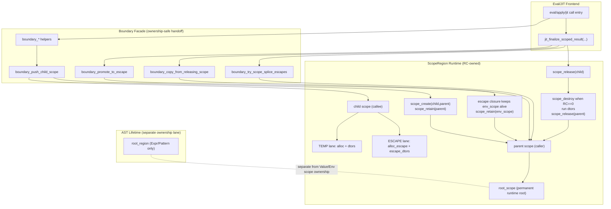
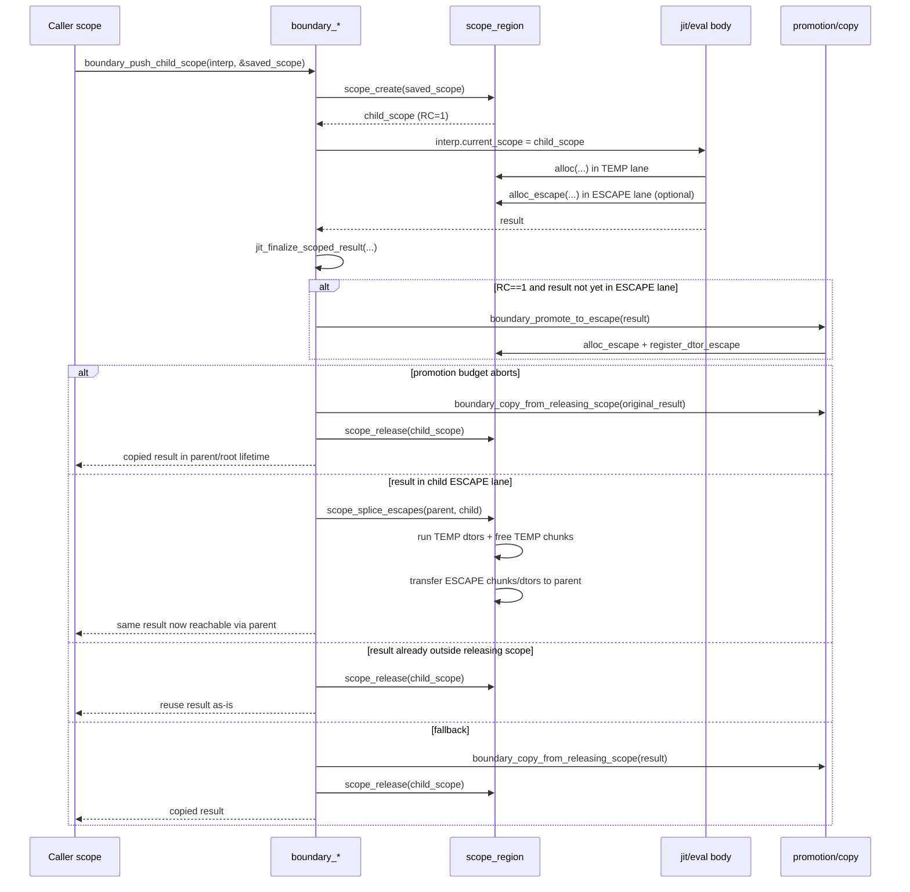
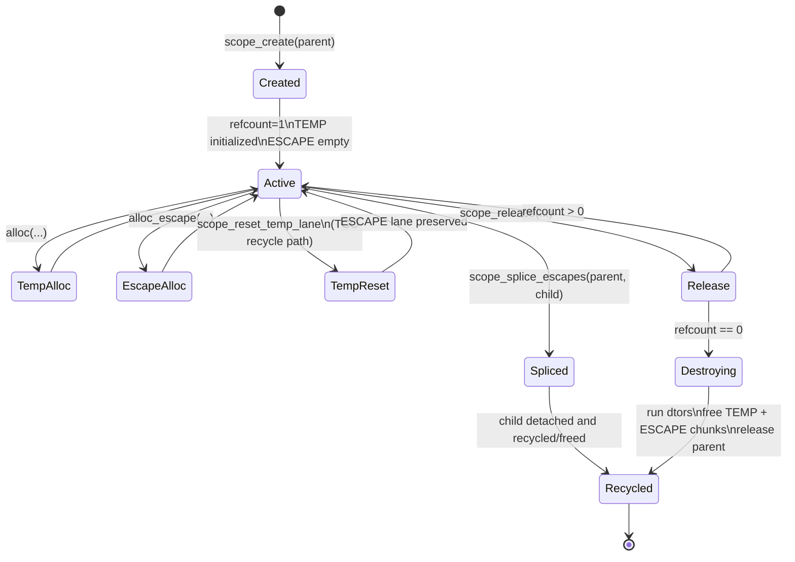
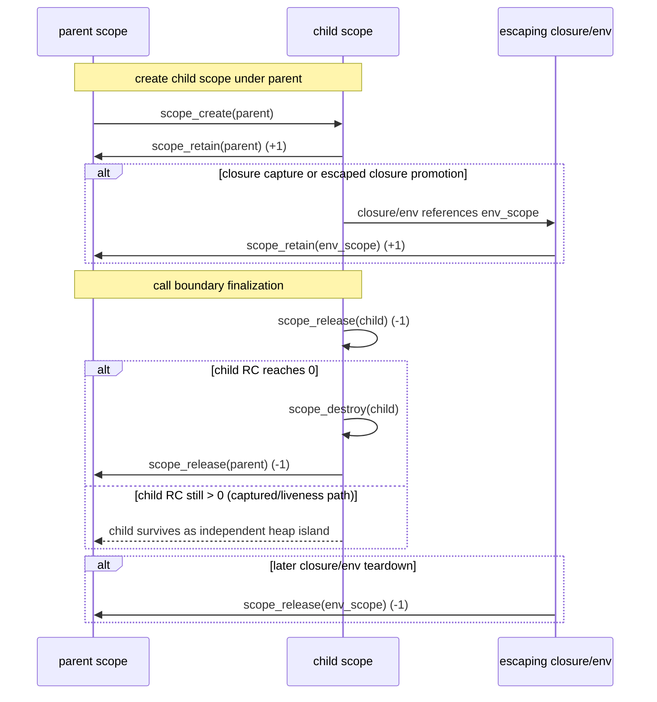

# Memory Runtime: End-to-End Architecture and Cycle

As of: 2026-03-07

This file is the end-to-end visual map for the current memory architecture and
runtime lifecycle, aligned to:

- `src/scope_region.c3`
- `src/lisp/eval_boundary_api.c3`
- `src/lisp/jit_jit_eval_scopes.c3`
- `src/lisp/eval_promotion_escape.c3`
- `src/lisp/value_interp_state.c3`

## 0) Master Single-File Diagram

Source:
- `docs/areas/diagrams/memory-runtime-cycle-master.mmd`

Rendered SVG:
- `docs/areas/diagrams/memory-runtime-cycle-master.svg`

## 1) End-to-End Architecture

## 2) Call-to-Return Memory Cycle

## 3) ScopeRegion Lifecycle State Machine

## 4) RC Ownership Cycle (Explicit)

## 5) Invariants (diagram reading key)

- Ownership authority is `ScopeRegion` RC (`scope_retain`/`scope_release`).
- Language values do not use per-type RC lifetime as the primary ownership
  mechanism.
- Root pinning is not a general correctness mechanism; only explicit
  process-lifetime singletons may use it.
- Boundary paths are the source of truth for return/env/mutation/promotion
  crossings.
